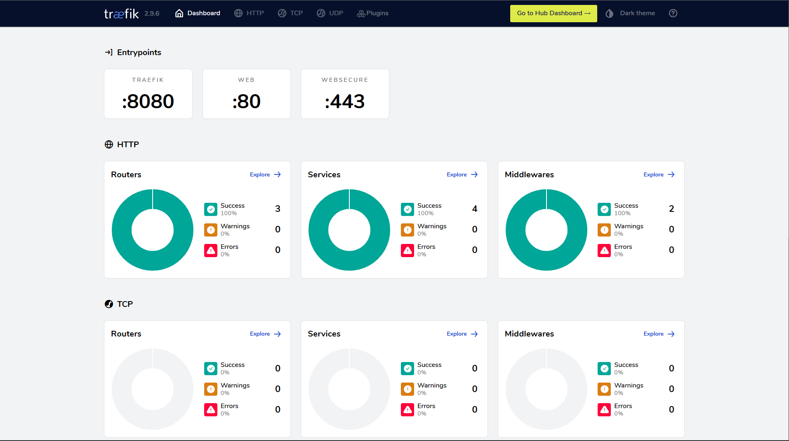

<div id="top"></div>
<h1 align="center">Traefik Binary Installation + Wildcard Certificates</h1>
<p>The following is a guide on how to install traefik without docker on a linux (Ubuntu 22.04) machine and acquire wildcard certificates using DNS Challenge with Cloudflare as the provider.</p>


<!-- TABLE OF CONTENTS -->
## :ledger: Table of Contents
- [:memo: Introduction ](#introduction)
- [:desktop\_computer: System Preperation ](#SystemPreperation)
  - [:arrow_down: Download the binary](#download)
  - [:package: Moving binary to the correct location](#MovingBinary)
  - [:open\_file\_folder: Setup folders/files, user, group and permissions](#permissions)
  - [:gear: Create a systemd service for Traefik](#systemd)
- [:cd: Traefik preperation](#traefikPreperation)
  - [:memo: Create the Traefik static config file](#staticConfig)
  - [:key: Edit the .env file](#envFile)
  - [:memo: Create a dynamic config file](#dynamicConfig)
- [:running: Running traefik](#runningTraefik)
  - [:bulb: Enable the traefik service](#enableService)
  - [:bar_chart: Accessing the dashboard](#accessDashboard)
- [:wrench: Troubleshooting](#troubleshooting)
  - [:x: Traefik is not running](#notRunning)
  - [:bookmark_tabs: Problems with the traefik configuration](#misconfigured)

****
<!-- INSTALLATION -->
## :desktop_computer: System Preperation <a id="SystemPreperation"></a>
### :arrow_down: Download the binary<a id="download"></a>
Go to the official [Traefik Github reposity](https://github.com/traefik/traefik/releases) and download the latest stable release.

``` bash
cd /tmp

wget https://github.com/traefik/traefik/releases/download/v2.9.6/traefik_v2.9.6_linux_amd64.tar.gz

tar xzvf traefik_v2.9.6_linux_amd64.tar.gz
```

<p align="right">(<a href="#top">back to top</a>)</p>

### :package: Moving binary to the correct location <a id="MovingBinary"></a>
After downloading and extracting the binary, place it in ```/usr/local/bin/```.

```bash
sudo cp /tmp/traefik /usr/local/bin/.
sudo chown root:root /usr/local/bin/traefik
sudo chmod 755 /usr/local/bin/traefik
```

<p align="right">(<a href="#top">back to top</a>)</p>

### :open_file_folder: Setup folders/files, user, group and permissions <a id="permissions"></a>
Give the Traefik binary the ability to bind to privileged ports (80, 443) as non-root.

```bash
sudo setcap 'cap_net_bind_service=+ep' /usr/local/bin/traefik
```

<p align="right">(<a href="#top">back to top</a>)</p>

Setup Traefik user, group and permissions.
```bash
sudo groupadd traefik
sudo useradd \
    -g traefik --no-user-group \
    -d /etc/traefik --no-create-home \
    -s /usr/sbin/nologin \
    -r traefik 
```

<p align="right">(<a href="#top">back to top</a>)</p>

Create folder for the traefik static and dynamic config files and set permissions.
```bash
sudo mkdir /etc/traefik
sudo mkdir /etc/traefik/dynamic
sudo chown -R root:root /etc/traefik
sudo chown -R traefik:traefik /etc/traefik/dynamic
```

<p align="right">(<a href="#top">back to top</a>)</p>

Create a log file for traefik and set permissions.
```bash
sudo touch /var/log/traefik.log
sudo chown traefik:traefik /var/log/traefik.log
```

<p align="right">(<a href="#top">back to top</a>)</p>

Create the .env file for the DNS Challenge credentials.
```bash
sudo touch /etc/traefik/.env
```

<p align="right">(<a href="#top">back to top</a>)</p>

Create the file where the certificates will be stored and set permissions.
```bash
sudo mkdir /etc/traefik/acme/
sudo touch /etc/traefik/acme/acme.json
sudo chmod 600 /etc/traefik/acme/acme.json
```

<p align="right">(<a href="#top">back to top</a>)</p>

### :gear: Create a systemd service for Traefik<a id="systemd"></a>
Create a file called ```traefik.service``` and place it in the path ```/lib/systemd/system/``` with the following content.
```
# /lib/systemd/system/traefik.service
[Unit]
Description=Traefik reverse proxy service
After=network-online.target
Wants=network-online.target systemd-networkd-wait-online.service

[Service]
Restart=on-failure

User=traefik
Group=traefik

ProtectHome=true
ProtectSystem=full
ReadWriteDirectories=/etc/traefik/acme
CapabilityBoundingSet=CAP_NET_BIND_SERVICE
AmbientCapabilities=CAP_NET_BIND_SERVICE
NoNewPrivileges=true

TimeoutStopSec=300
EnvironmentFile=/etc/traefik/.env
ExecStart=/usr/local/bin/traefik --configFile=/etc/traefik/traefik.yml

[Install]
WantedBy=multi-user.target
```

<p align="right">(<a href="#top">back to top</a>)</p>

Change the permissions and update the systemd index.
```bash
sudo chown root:root /lib/systemd/system/traefik.service
sudo chmod 644 /lib/systemd/system/traefik.service
sudo systemctl daemon-reload
```

<p align="right">(<a href="#top">back to top</a>)</p>

****
## :cd: Traefik preperation <a id="traefikPreperation"></a>
### :memo: Create the Traefik static config file<a id="staticConfig"></a>
```bash
sudo touch /etc/traefik/traefik.yml
```
Edit the config file and add some basic configuration.
```yml
# Traefik static configuration file (/etc/traefik/traefik.yml)
# See https://doc.traefik.io/traefik/getting-started/configuration-overview/#the-static-configuration
# and https://doc.traefik.io/traefik/reference/static-configuration/cli/

# (Global Config)
global:
  checkNewVersion: true
  sendAnonymousUsage: false

# (API)
api:
  dashboard: true
  insecure: true

# (PILOT)
pilot:
  dashboard: false

# (Logs)
log:
  filePath: "/var/log/traefik.log"
  format: json
  level: "ERROR"

# (Providers)
providers:
  file:
    directory: "/etc/traefik/dynamic"
    watch: true

# (EntryPoints)
entryPoints:
  web:
    address: ":80"
    # (Optional)
    http:
      redirections:
        entryPoint:
          to: websecure
          scheme: https


  websecure:
    address: ":443"
    http:
      tls:
        certResolver: letsencrypt
        domains:
          - main: "something.com"
            sans:
              - "*.something.com"

# (Certificate Resolvers)
certificatesResolvers:
  letsencrypt:
    acme:
      email: #Your Email Address
      storage: /etc/traefik/acme/acme.json
      dnsChallenge:
        provider: cloudflare
        resolvers:
          - "1.1.1.1:53"
          - "1.0.0.1:53"
```

<p align="right">(<a href="#top">back to top</a>)</p>

### :key: Edit the .env file<a id="envFile"></a>
The variable names you use depends on your provider. You can refer to the [providers sections](https://doc.traefik.io/traefik/https/acme/#providers) on the official [Traefik documentation](https://doc.traefik.io/traefik/) for the correct variable names for your use case. Since I am using cloudflare the variable names I need to use are ```CF_EMAIL``` and ```CF_API_KEY```.

```bash
sudo nano /etc/traefik/.env
```
```
CF_EMAIL=something@example.com
CF_API_KEY=some_api_key
```
<p align="right">(<a href="#top">back to top</a>)</p>

### :memo: Create a dynamic config file<a id="dynamicConfig"></a>
```bash
sudo touch /etc/traefik/dynamic/dynamic.yml
```
Now edit the dynamic config file based on your specific needs. The dynamic config file will be used for storing the configurations for the services you wish to expose. In my case I have a vm with an ip of (192.168.1.50) running NGINX I would like to expose.

```yml
http:
  routers:
    nginx:
      entryPoints:
        - websecure
      rule: "Host(`nginx.mydomain.com`)"
      service: nginx-service


  services:
    nginx-service:
      loadBalancer:
        servers:
          - url: "http://192.168.1.50"
```
You may refer to the [official documentation](https://doc.traefik.io/traefik/) for more advanced configurations.

<p align="right">(<a href="#top">back to top</a>)</p>

****

## :running: Running traefik<a id="runningTraefik"></a>

### :bulb: Enable the traefik service<a id="enableService"></a>
Now that the configuration is finished you can start traefik with the following command.
```bash
sudo systemctl start traefik.service
```
If you want to automatically start on system boot use this command.
```bash
sudo systemctl enable traefik.service
```

<p align="right">(<a href="#top">back to top</a>)</p>

### :bar_chart: Accessing the dashboard

You can access the traefik dashboard on your browser by typing the IP of the machine running traefik followed by the port number ```8080```. The dashboard should look something like this:


<p align="right">(<a href="#top">back to top</a>)</p>

****

## :wrench: Troubleshooting<a id="troubleshooting"></a>

### :x: Traefik is not running<a id="noRunning"></a>
If the traefik service is not running you can use the following command to investigate why.
```bash
sudo journalctl --boot -u traefik.service
```

<p align="right">(<a href="#top">back to top</a>)</p>

### :bookmark_tabs: Problems with the traefik configuration<a id="misconfigured"></a>
If traefik is runnning but you experiencing undesired behavior it may be caused by a misconfiguration. You can use the log file to help you identify the problem.
```bash
sudo cat /var/log/traefik.log
```

<p align="right">(<a href="#top">back to top</a>)</p>